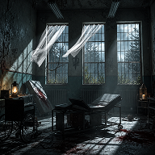
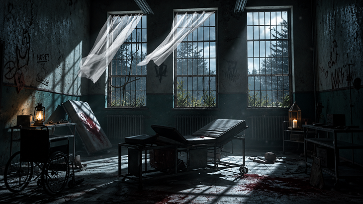
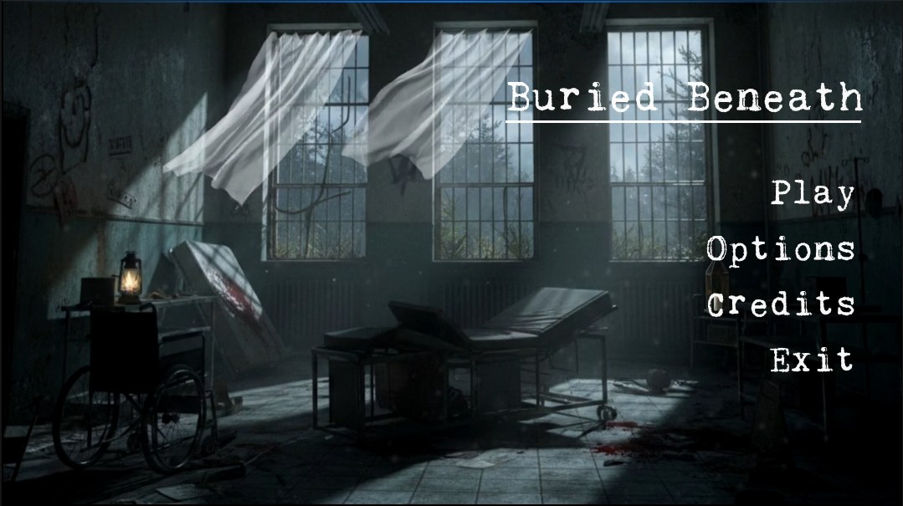
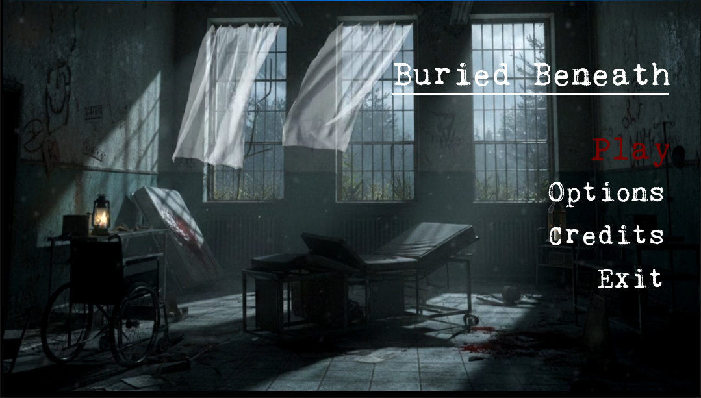
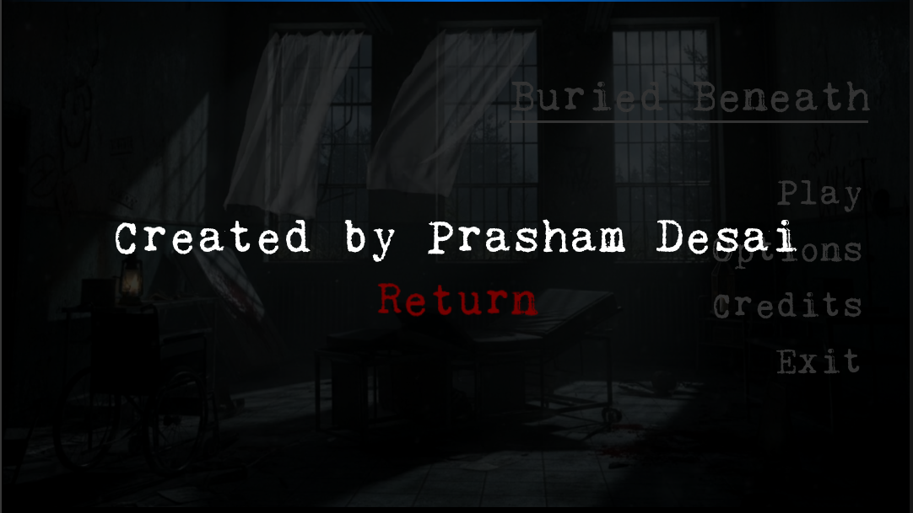
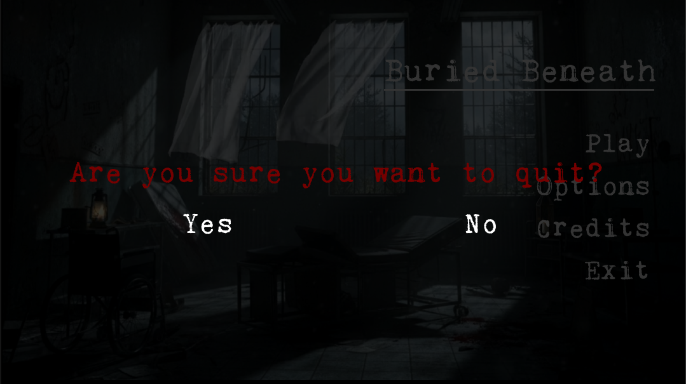

<p align="center">
  
</p>

<h1 align="center">🩸 Buried Beneath — Main Menu</h1>

<p align="center">
  <b>A cinematic, AAA-quality interactive main menu built entirely in Unreal Engine 5.6</b>
</p>

<p align="center">
  
  
  
  
</p>

---

> **⚠️ Note:** This is **not** a full game — it is a standalone, polished **main menu system** designed to demonstrate a production-ready, triple-A title screen experience with full audio-visual polish.

---

## 🎬 Overview

**Horror Game Menu** is a fully interactive, cinematic main menu screen built in **Unreal Engine 5.6** using **100% Blueprints**. It features a looping video background, dynamic fade-in animations, multi-layered audio feedback (hover, click, press), a credits screen, and a quit confirmation dialog — all wrapped in a dark, atmospheric horror aesthetic.

The project is designed as a reusable menu template that can be dropped into any horror (or dark-themed) game project.

---

## 🎨 Splash Screen & Logo

<p align="center">
  
  <br/><em>Custom Splash Screen — Abandoned asylum atmosphere sets the tone before the menu even loads</em>
</p>

<p align="center">
  
  <br/><em>Project Logo — Moonlit haunted house</em>
</p>

---

## ✨ Features

### 🖥️ Main Menu Screen
- **Looping Video Background** — A cinematic, dark-atmosphere video plays seamlessly behind the menu, giving the screen a living, breathing feel worthy of a AAA title.
- **Dynamic Fade-In Animation** — All UI elements animate in with smooth fade/slide transitions when the menu loads, creating a polished first impression.
- **Custom Horror Font** — Uses the *Kingthings Trypewriter* typeface for an eerie, vintage horror aesthetic.
- **Custom Menu Background Material** — Dedicated material (`MP_BG` / `MP_BG_Video`) drives the video background within the widget system.

### 🎮 Interactive Buttons
- **Color Change on Hover** — Buttons shift color when the cursor hovers over them, providing clear visual feedback.
- **Color Change on Click** — A distinct pressed color state gives satisfying tactile feedback.
- **Reusable Button Widget** (`WBP_Button`) — A single, self-contained button blueprint that handles all visual states (Normal → Hovered → Pressed), making it trivial to add new menu options.

### 🔊 Audio & Sound Design
- **Hover Sound Effects** — Subtle audio cue plays when a button is hovered (multiple variants: `MSS_Click1`, `MSS_Click2`, `MSS_Click3`).
- **Click / Press Sound Effects** — Satisfying click sounds fire on button press (variants: `VR_click1`, `VR_click2`, `VR_click3`).
- **Looping Background Music** — An ambient horror soundtrack (`Sound.uasset`) loops continuously while the menu is active, building atmosphere from the moment the game launches.

### 📜 Credits Screen
- **Dedicated Credits Widget** (`WBP_Credits`) — A full credits screen accessible from the main menu.
- **Smooth Transition** — Animated transition between the main menu and credits screen.
- **Back Navigation** — Easy return to the main menu.

### 🚪 Exit / Quit Confirmation
- **Quit Confirmation Dialog** (`WBP_QuitConfirm`) — Instead of immediately closing, the game presents a confirmation prompt ("Are you sure you want to quit?") to prevent accidental exits.
- **Styled to Match** — The dialog uses the same horror aesthetic as the rest of the menu.

### 🎨 Custom Splash Screen
- **Branded Splash** — Custom editor and game splash screens (`Splash.png` / `EdSplash.png`) for a professional touch even before the menu loads.

---

## 📁 Project Structure

```
HorrorGameMenu/
├── Content/
│   ├── Fonts/                          # Custom horror typeface
│   │   ├── Kingthings_Trypewriter_2.uasset
│   │   └── Kingthings_Trypewriter_2_Font.uasset
│   ├── Levels/
│   │   └── LV_MainMenu.umap           # The main menu level
│   ├── Sounds/                         # All audio assets
│   │   ├── MSS_Click1/2/3.uasset      # Hover sound variants
│   │   ├── VR_click1/2/3.uasset       # Click/press sound variants
│   │   └── Sound.uasset               # Looping background music
│   ├── Splash/                         # Custom splash screens
│   │   ├── EdSplash.png
│   │   └── Splash.png
│   ├── Textures/
│   │   └── MenuBG.uasset              # Menu background texture
│   ├── Videos/                         # Looping background videos
│   │   ├── BGVid.uasset
│   │   ├── BGVidLoop__1_.uasset
│   │   ├── BG_Loop_One.uasset
│   │   ├── Loop_BG.uasset
│   │   ├── MenuBGVid.uasset
│   │   └── Video_Project_7.uasset
│   └── Widgets/
│       └── MainMenu/                   # All menu UI blueprints
│           ├── BP_MainMenu.uasset      # Main menu game mode / controller
│           ├── BP_MainMenuPawn.uasset  # Menu pawn (input handling)
│           ├── MP_BG.uasset            # Background material
│           ├── MP_BG_Video.uasset      # Video background material
│           ├── WBP_Button.uasset       # Reusable button widget
│           ├── WBP_Credits.uasset      # Credits screen widget
│           ├── WBP_Menu.uasset         # Main menu widget
│           └── WBP_QuitConfirm.uasset  # Quit confirmation dialog
├── Config/                             # Engine & input config
├── HorrorGameMenu.uproject             # UE5.6 project file
└── HorrorGameMenu.png                  # Project thumbnail
```

---

## 🚀 Getting Started

### Prerequisites

| Requirement | Version |
|---|---|
| **Unreal Engine** | 5.6+ |
| **Platform** | Windows (developed & tested) |

### Setup

1. **Clone the repository**
   ```bash
   git clone https://github.com/YOUR_USERNAME/HorrorGameMenu.git
   ```

2. **Open in Unreal Engine**
   - Launch Unreal Engine 5.6
   - Open `HorrorGameMenu.uproject`

3. **Play**
   - Open `Content/Levels/LV_MainMenu` in the editor
   - Hit **Play** (or **Standalone Game**) to experience the full menu

> **💡 Tip:** For the best experience, run in **Standalone Game** mode so the video background and audio loop correctly.

---

## 🛠️ Customization

This menu system is designed to be easily customizable:

| What | Where | How |
|---|---|---|
| **Button text / count** | `WBP_Menu` | Add/remove `WBP_Button` instances in the widget designer |
| **Button colors** | `WBP_Button` | Edit the Normal, Hovered, and Pressed color properties |
| **Background video** | `Videos/` | Replace the video asset and update `MP_BG_Video` |
| **Background music** | `Sounds/Sound` | Swap the audio asset |
| **Hover / Click SFX** | `Sounds/MSS_*` / `VR_*` | Replace with your own sound cues |
| **Font** | `Fonts/` | Import a new font and update the font asset reference |
| **Credits content** | `WBP_Credits` | Edit the text block in the widget designer |
| **Splash screen** | `Splash/` | Replace `Splash.png` and `EdSplash.png` |

---

## 🎥 Video Demo

https://github.com/Prasham-Desai/HorrorGameMenu/raw/main/Screenshots/Video%20Demo.mp4

<p align="center"><em>Full walkthrough — Menu navigation, hover effects, click sounds, credits, and quit confirmation</em></p>

---

## 📸 Screenshots

<table>
  <tr>
    <td align="center"><br/><em>Main Menu — Title screen with looping video background</em></td>
    <td align="center"><br/><em>Hover State — "Play" button turns red on hover</em></td>
  </tr>
  <tr>
    <td align="center"><br/><em>Credits — "Created by Prasham Desai" with Return button</em></td>
    <td align="center"><br/><em>Quit Confirmation — Yes / No dialog in typewriter style</em></td>
  </tr>
</table>

---

## 🔧 Tech Stack

- **Engine:** Unreal Engine 5.6
- **Language:** 100% Blueprints (no C++)
- **UI System:** UMG (Unreal Motion Graphics)
- **Plugins Used:**
  - `ModelingToolsEditorMode`
  - `GameplayStateTree`

---

## 📄 License

This project is open source and available under the [MIT License](LICENSE).

---

## 🤝 Contributing

Contributions, issues, and feature requests are welcome! Feel free to open an issue or submit a pull request.

---

<p align="center">
  <sub>Built with 🩸 and Unreal Engine 5.6</sub>
</p>
